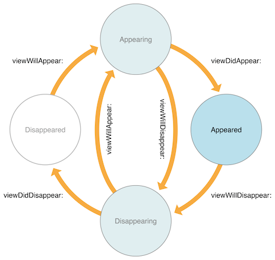

### 앱 실행
- ViewController - viewDidLoad()
- ViewController - viewWillAppear
- ViewController - viewDidAppear

### Push Detail VC
- ViewController - viewWillDisappear
- DetailViewController - viewDidLoad()
- DetailViewController - viewWillAppear
- ViewController - viewDidDisappear
- DetailViewController - viewDidAppear

### Detail VC 닫기 (back button 사용)
- DetailViewController - viewWillDisappear
- ViewController - viewWillAppear
- DetailViewController - viewDidDisappear
- ViewController - viewDidAppear

### Detail VC 닫기 (Swipe 사용)
- DetailViewController - viewWillDisappear
- ViewController - viewWillAppear
- DetailViewController - viewDidDisappear
- ViewController - viewDidAppear

### Detail VC 닫으려다가 취소 (Swipe 사용)
- DetailViewController - viewWillDisappear
- ViewController - viewWillAppear
- // Swipe 취소
- ViewController - viewWillDisappear
- ViewController - viewDidDisappear
- DetailViewController - viewWillAppear
- DetailViewController - viewDidAppear

